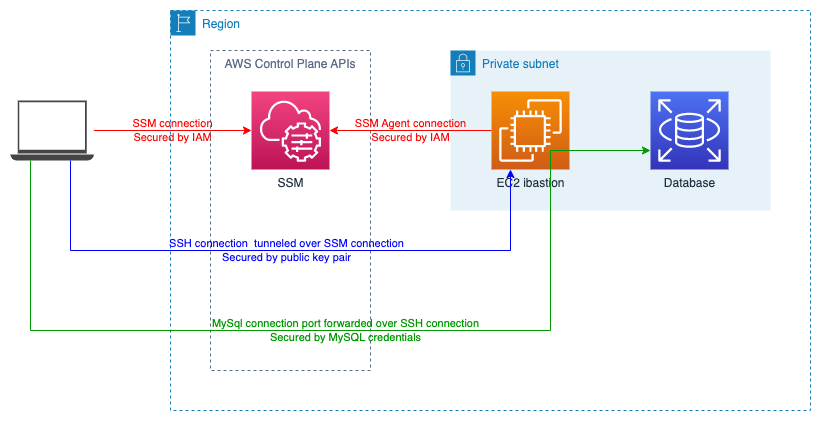
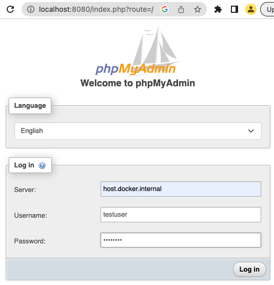

# Connect to database in AWS private subnet without VPC

Demonstrate the use of tunneling connect from a remote user workstation to a database in a private subnet in Amazon Web Services (AWS) using using Systems Manager (SSM) and Secure Shell (SSH) with SSH over SSM tunneling. We use phpMyAdmin in this example as this is a common ask for customers migrating from a cPanel solution to AWS.



NOTE: You may find VPN, e.g. using AWS ClientVPN or OpenVPN, or AWS Verified Access to be better solutions to this problem.

NOTE: Operational best practices suggest no manual changes should be allowed to production databases so please ensure that you don't use this as part of production operation workflows.

## Licence and Warranty

MIT No Attribution

Copyright 2022 Rudolf Potucek

Permission is hereby granted, free of charge, to any person obtaining a copy of this software and associated documentation files (the "Software"), to deal in the Software without restriction, including without limitation the rights to use, copy, modify, merge, publish, distribute, sublicense, and/or sell copies of the Software, and to permit persons to whom the Software is furnished to do so.

THE SOFTWARE IS PROVIDED "AS IS", WITHOUT WARRANTY OF ANY KIND, EXPRESS OR IMPLIED, INCLUDING BUT NOT LIMITED TO THE WARRANTIES OF MERCHANTABILITY, FITNESS FOR A PARTICULAR PURPOSE AND NONINFRINGEMENT. IN NO EVENT SHALL THE AUTHORS OR COPYRIGHT HOLDERS BE LIABLE FOR ANY CLAIM, DAMAGES OR OTHER LIABILITY, WHETHER IN AN ACTION OF CONTRACT, TORT OR OTHERWISE, ARISING FROM, OUT OF OR IN CONNECTION WITH THE SOFTWARE OR THE USE OR OTHER DEALINGS IN THE SOFTWARE.

## POC

### Create ssh key pair for ec2-user on bastion

Create a key pair - we will do this in the local folder to not pollute `~/.ssh`:

```bash
ssh-keygen -f ./ec2-user
```

For convenience we will use the resulting `ec2-user.pub` file and pass it to the template for creating the EC2 instance but you can use other distribution methods as well.

### Create "bastion" and "mysql" EC2 instances

This creates a linux "bastion" instance and a linux "mysql" instance, both with an instance role that includes the `SsmManagedInstanceCore` policy to allow SSM access. We are creating a mysql instance because is faster than setting up RDS but this works the same with RDS. 

```bash
aws cloudformation deploy \
    --stack-name ssm-over-ssh-instances \
    --template-file template.yaml \
    --parameter-overrides SshPublicKeyMaterial="$(cat ./ec2-user.pub)" \
    --capabilities CAPABILITY_NAMED_IAM
```

You can validate SSM access to the bastion instance from the AWS console:

1. Navigate to the [EC2 console](https://console.aws.amazon.com/ec2/home?#Instances:instanceState=running;v=3;$case=tags:true%5C,client:false;$regex=tags:false%5C,client:false), select "Instance", select `SshOverSsmBastionInstance` instance name, select "Connect" button
2. Select "Session Manager" tab, select "Connect"
3. Change user with `sudo su -`

### Configure AWS CLI connectivity

Follow the AWS [documentation](https://docs.aws.amazon.com/cli/latest/userguide/cli-chap-configure.html) to install and configure the AWS CLI. 

Once you have that configured you can verify STS authentication with 

```bash
aws sts get-caller-identity
```

Follow the [SSM Session Manager configuration instructions](https://docs.aws.amazon.com/systems-manager/latest/userguide/session-manager.html) and you can verify SSM terminal connectivity using your AWS credentials:

```bash
SSM_BASTION_ID=$( aws cloudformation describe-stacks --stack-name ssm-over-ssh-instances --query "Stacks[].Outputs[?OutputKey=='Bastion'].OutputValue" --output text )

aws ssm start-session \
    --target ${SSM_BASTION_ID}
```

You should now be in a terminal session on the bastion host. Note that you are logged in as the `ssm-user` so you may have to `sudo` for what you want to do beyond this.

### Configure SSH over SSM

In the previous section we established a terminal session. We can use this session to tunnel SSH as per the [docs](https://docs.aws.amazon.com/systems-manager/latest/userguide/session-manager-getting-started-enable-ssh-connections.html).

This works by combining ssh `ProxyCommand` and netcat to establish a tunnel. 

You can try this manually:

```bash
SSM_BASTION_ID=$( aws cloudformation describe-stacks --stack-name ssm-over-ssh-instances --query "Stacks[].Outputs[?OutputKey=='Bastion'].OutputValue" --output text )

ssh -i ./ec2-user -o ProxyCommand="sh -c \"aws ssm start-session --target %h --document-name AWS-StartSSHSession --parameters 'portNumber=%p'\"" ${SSM_BASTION_ID}
```

But it's much more convenient to move this into `ssh_config` as described in the [docs](https://docs.aws.amazon.com/systems-manager/latest/userguide/session-manager-getting-started-enable-ssh-connections.html). Again we will configure this in the local directory to not pollute `~/.ssh/config`:

```bash
cat > ./ssh_config <<EOT
Host i-* mi-*
    ProxyCommand aws ssm start-session --target %h --document-name AWS-StartSSHSession --parameters 'portNumber=%p'
    User ec2-user
    IdentityFile ./ec2-user
EOT

ssh -F ./ssh_config ${SSM_BASTION_ID}
```

### SSH tunnels

SSH has powerful port forwarding capabilities. In our example we want a tool on our local machine to connect to a database in a private subnet in AWS. To do this we use ssh to listen to `localhost:3306` and tunnel all traffic to that port to `Mysql:3306`:

```bash
MYSQL_IP=$( aws cloudformation describe-stacks --stack-name ssm-over-ssh-instances --query "Stacks[].Outputs[?OutputKey=='MysqlIp'].OutputValue" --output text )

ssh -F ./ssh_config -L3306:${MYSQL_IP}:3306 ${SSM_BASTION_ID}
```

### Connect with mysql client

We created a database named `testdb`, accessible to user `testuser` with password `testpass`:

```bash
mysql --protocol TCP -h localhost -P 3306 -u testuser -p testdb
```

which we can shorten because the tunnel is on localhost:
```bash
mysql --protocol TCP -u testuser -p testdb
```

### Connect using docker container

```bash
docker run --rm --name myadmin -d -e PMA_ARBITRARY=1 -p 8080:80 phpmyadmin
```

Browse to https://localhost:8080 and in the web interface enter `host.docker.internal`, `testuser` (or your parameter override), and `testpass` (or your parameter override):



Select "Log in" and you have access to your database in AWS via phpMyAdmin. 

## Alternatives

* Use a VPN
* Use AWS Verified Access

## Extensions

* you can use the same approach with SSM hybrid instances to connect to on-prem machines running the SSM Agent.
* you can use the same approach with an RDS connection URL
* you can use the same approach for other tunnels like RDP

## Cleanup

To avoid ongoing costs from this demo, make sure to delete the CloudFormation stack:

```bash
aws cloudformation delete-stack --stack-name ssm-over-ssh-instances
aws cloudformation wait stack-delete-complete --stack-name ssm-over-ssh-instances
```

